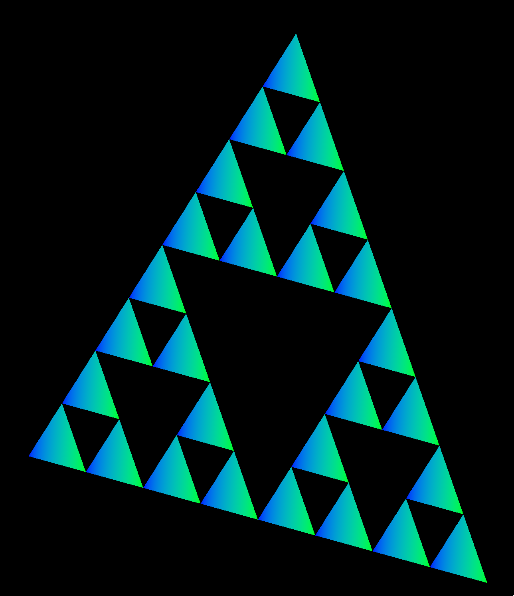

# Vulkan Tutorial
I am following a vulkan tutorial on youtube, found [here](https://www.youtube.com/watch?v=lr93-_cC8v4&list=PL8327DO66nu9qYVKLDmdLW_84-yE4auCR&index=2).

There are some coding style things that I don't agree with, and sometimes I'll change things depending on my own feelings.

## Video 1 - Introduction 
No notes; they set up a build environment using vscode on macos which I am not going to use.

## Video 2 - Create a Window
Created a window for our thing to live in!

## Video 2 - Graphics Pipeline Overview
Learned about the graphics pipeline, which parts of it are configurable and what a shader is. Implemented and compiled an extremely simple shader using glsl.

Very interesting! I'm excited to learn more about all of this stuff, we'll see when the anxiety and/or ADHD hits 😅

## Video 3 - Device Setup
Learned how to contact the graphics device, and set up a kind of interface (?) to it. This video was hard to grok, partly because it relied on downloading a bunch of boilerplate code. I do think is the right call by mr Galea (the author of the tutorial series) because there was quite a bit of it and doing all of this setup was already a bit challenging. It is also a bit tricky to keep track of all the components since it isn't trivial to understand how they will all interact in the final product.

## Video 4 - Fixed Function Pipeline Stages
Configured the fixed function pipeline stages. The configuration pattern of creating structs and passing them to Vulkan is a bit foreign but intuitive - I wish the tutorial would have taken the time to explain the division of responsibility a bit more here, it feels as though we're setting up something that is the way we want it but skipping past the naïve approach of just hard-setting things first. Maybe things will become a bit clearer, but this video was a lot of typing with a bit less understanding even though I looked up the concepts and skipped back whenever I missed something.

I also figured out a game I might want to make! More on that in another repo. Maybe.

## Video 5 - Swap Chain Overview
I now understand a tiny bit about swap chains, image buffers and difference image buffer modes - or at least the existence of them. All the errors are now gone, and the code opens... an empty window! Yay!

## Video 6 - Command Buffers Overview
Most of this may have gone over my head; command buffers are a way of structuring commands in our calls to the GPU, and "recording" commands so that they can be reused on subsequent passes. At the end, at least we drew a red triangle! Then changed it to be magenta.

## Video 7 - Vertex Buffers
Vertex buffers are groups of vertex attributes, where different vertex attributes (position, RGB values etc) are placed in buffers. We must "bind" vertex buffers descriptions to the graphics pipeline, defining stride etc. This is done in a "Vertex Attribute Description" that contains the binding, location, offset and format. Whether buffers should be interleaved or separate, depends on the implementation.
In this tutorial, we will allocate memory ourselves - that's to do with all the `nullptr` we've been passing in everywhere. But for serious projects, one probably wants to use a memory allocation library such as VMA.

## Video 8 - Fragment Interpolation
We looked at how data is passed from vertex shaders to fragment shaders, and colored our fractal triangles in! Oh yeah; as an optional exercise I created a sierpinski triangle generator. I'm actually fairly proud of being able to code it straight up and have it work straight away, even though it's basically CS Bachelor BS 🤓

## Video 9 - Swap Chain Recreation & Dynamic Viewports
In order for the program not to crash on resizing the window, a more robust swap chain logic was implemented.
1. The window now detects when it's being resized, and waits idle for the resizing to be done before resuming so that it does not crash due to the swap chain being dependent on the window dimensions
2. The program now checks if the swap chain is still valid and recreates it if it isn't due to window resizing
3. The viewport and scissor are now dynamic so that the graphics pipeline is no longer dependent on swapchain dimensions.

This video was easier to follow, but my overview of the code is still pretty poor. I should probably sit down and go through it all at some point, but I keep feeling like the tutorial creator said we would do that in a video so I guess I'm waiting for that to happen in hopes of there being some visual aids to remind me what's been going on.

## Video 10 - Push Constants
Push constants are small but fast modifications to data such as vertices or colors, that can be used to e.g. quickly draw multiple copies of the same object. They have three sections:
1. Stage Flags, that specify which part of the pipeline has access to the push constant
2. Offset is the offset in bytes (must be multiple of 4)
3. Size is the size of the push constant in bytes (must be multiple of 4)
The Vulkan spec only guarantees 128 bytes of space shared between all shader stages.
Only one push constant block can be specified per shader entry point, and the push constants must be very strictly aligned.

One of the most common uses of push constants is to store transformation matrices.

We drew multiple copies of our triangle and colored it a bit differently using push constants, and also created a small animation by updating the values of the push constant for each frame.

## Video 11 - 2d Transformations
We implemented a game object, and learned a little bit about how to pass transformation matrices to shaders. Again, I understand all of these concepts but the way they're presented without any periodic overview or reminders means I will have to go back and re-figure all of this out at least one more time.

## Progress

- [x] Video 1 - Introduction
- [x] Video 2 - Graphics Pipeline Overview
- [x] Video 3 - Device Setup
- [x] Video 4 - Fixed Function Pipeline Stages
- [x] Video 5 - Swap Chain Overview
- [x] Video 6 - Command Buffers Overview
- [x] Video 7 - Vertex Buffers
- [x] Video 8 - Fragment Interpolation
- [x] Video 9 - Swap Chain Recreation & Dynamic Viewports
- [x] Video 10 - Push Constants
- [x] Video 11 - 2d Transformations
- [ ] Video 12
- [ ] Video 13
- [ ] Video 14
- [ ] Video 15
- [ ] Video 16
- [ ] Video 17
- [ ] Video 18
- [ ] Video 19
- [ ] Video 20
- [ ] Video 21
- [ ] Video 22
- [ ] Video 23
- [ ] Video 24
- [ ] Video 25
- [ ] Video 26
- [ ] Video 27
- [ ] Video 28
- [ ] Video 29
- [ ] Video 30

